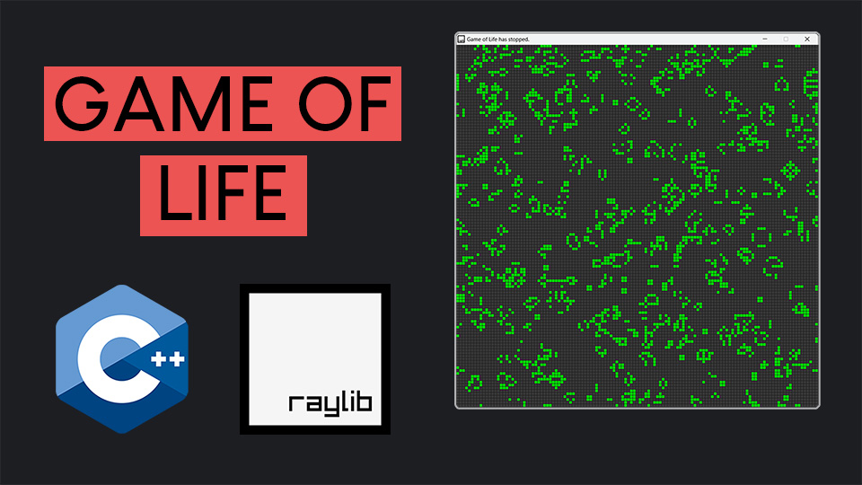

# CPP Game Of Life with raylib

This is a C++ implementation of Conway's Game of Life using raylib for graphics. The Game of Life, also known simply as Life, is a cellular automaton devised by the British mathematician John Horton Conway in 1970. It's a zero-player game, meaning its evolution is determined by its initial state, requiring no further input from human players. Players set up the initial configuration of cells on a grid, and then watch as generations evolve over time.

The project aims to provide an interactive experience, allowing users to visually explore the behavior of cellular automata through various patterns and configurations. Whether you're a seasoned programmer looking to experiment with raylib and cellular automata, or a beginner curious about the fascinating world of emergent complexity from simple rules, this tutorial offers something for everyone.

## Features

- **Interactive Grid**: Click to toggle cells between alive and dead states, crafting your initial setup or modifying it on the fly.
- **Control Simulation Flow**: Easily start, pause, or reset your simulation with keyboard shortcuts.
- **Dynamic Speed Adjustment**: Use keyboard inputs to speed up or slow down the evolution of the generations.
- **Random Initialization**: Generate a random starting point to explore unexpected patterns and behaviors.
- **Infinite Grid**: Thanks to edge wrapping, experience an unbounded canvas for your cellular automata, allowing patterns to move seamlessly across the grid boundaries.

# Video Tutorial

  

🎥 <a href = "https://youtu.be/daFYGrXq0aw">Video Tutorial on YouTube</a>

 
 

| 📺 <a href="https://www.youtube.com/channel/UC3ivOTE5EgpmF2DHLBmWIWg">My YouTube Channel</a>
| 🌍 <a href="http://www.educ8s.tv">My Website</a> |  

## How to Run the Program

Getting started with the Game of Life simulation is straightforward. After cloning the repository and setting up your environment as outlined in the README, you're ready to launch the program and engage with the interactive simulation. Here's your guide to controlling and interacting with the Game of Life:

- **Start the Simulation**: Press `Enter` to initiate the simulation. Observe as the cells transition through generations, adhering to the Game of Life's rules.
- **Pause/Stop the Simulation**: Hit the `Spacebar` to pause the simulation at any moment.
- **Create a Random Initial State**: Tap `R` to populate the grid with a random mix of alive and dead cells, perfect for kicking off a new simulation with unforeseen developments.
- **Clear the Grid**: Want a clean slate? Press `C` to clear the grid, turning all cells to a dead state.
- **Adjust Simulation Speed**:
  - Increase the pace by pressing `F`, making the generations evolve quicker.
  - Slow things down with `S`, giving you a closer look at each generation's transformation.
- **Toggle Cell States with Mouse Click**: Click on any cell within the grid to toggle its state. Bringing an alive cell to death or reviving a dead cell allows you to manually craft or alter patterns and see how they unfold.

With these controls at your disposal, you have complete mastery over the simulation, offering a sandbox to explore the depth of the Game of Life from your perspective. Try out various initial setups, speeds, and patterns to uncover the endless possibilities hidden within this simple, yet profound simulation. Dive into the captivating world of cellular automata and enjoy the exploration!
